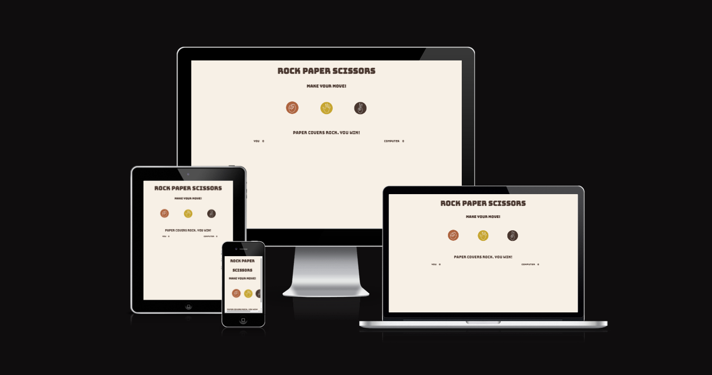
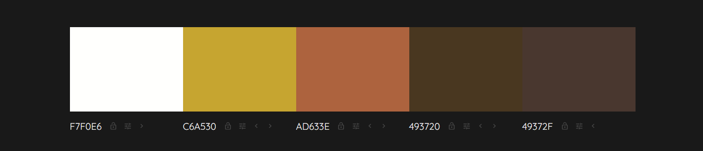
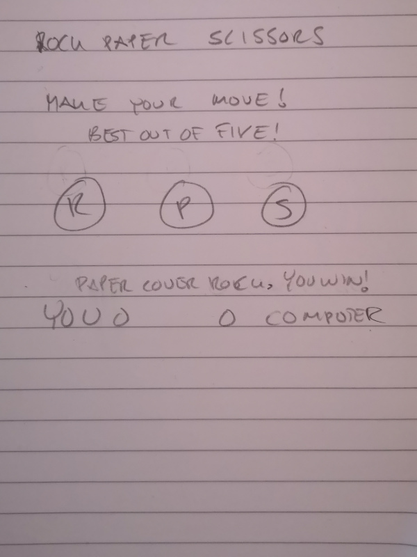
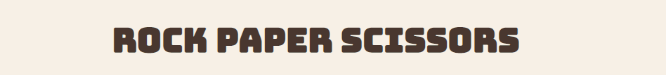
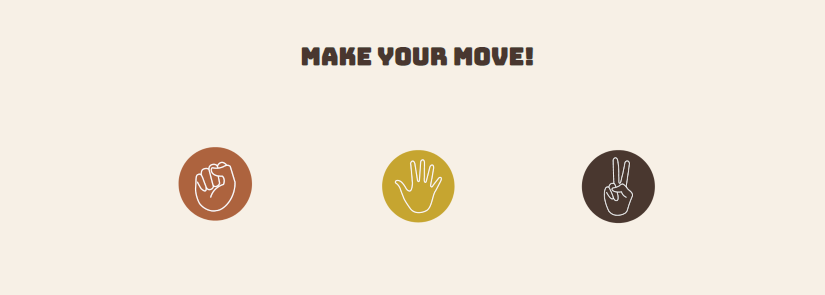
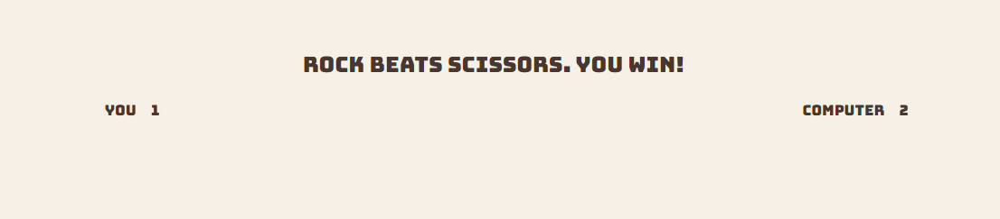
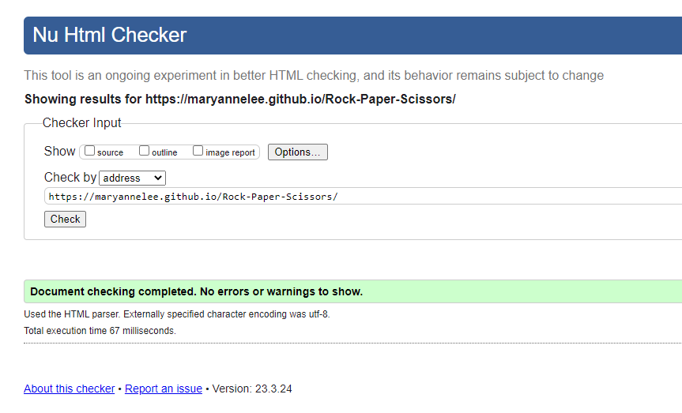
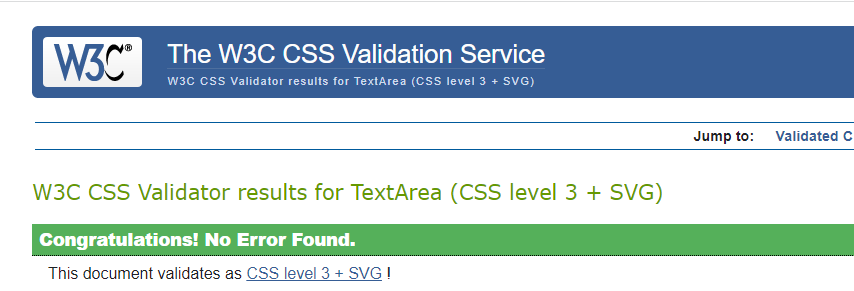
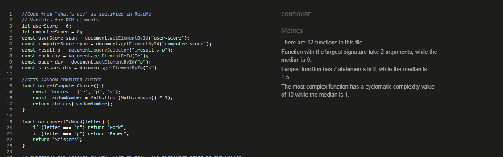
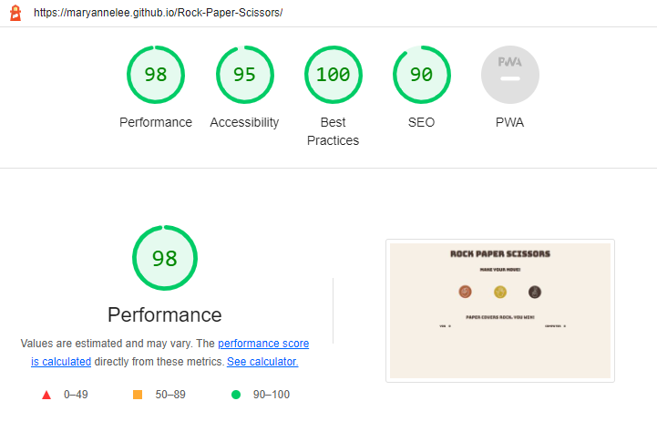

# Rock Paper Scissors

Rock Paper Scissors, a game created for the Project Portfolio 2 at Code Institute.

[View Rock Paper Scissirs on Github pages](https://github.com/MaryAnneLee/rock-paper-scissors)

---

## CONTENTS

* [User Experience](#user-experience-ux)
  * [User Stories](#user-stories)

* [Design](#design)
  * [Colour Scheme](#colour-scheme)
  * [Typography](#typography)
  * [Imagery](#imagery)
  * [Wireframes](#wireframes)

* [Features](#features)
  * [Future Implementations](#future-implementations)
  * [Accessibility](#accessibility)

* [Technologies Used](#technologies-used)
  * [Languages Used](#languages-used)
  * [Frameworks, Libraries & Programs Used](#frameworks-libraries--programs-used)

* [Deployment & Local Development](#deployment--local-development)
  * [Deployment](#deployment)
  * [Local Development](#local-development)
    * [How to Fork](#how-to-fork)
    * [How to Clone](#how-to-clone)

* [Testing](#testing)

* [Credits](#credits)
  * [Code Used](#code-used)
  * [Content](#content)
  * [Media](#media)
  * [Acknowledgments](#acknowledgments)

---

## User experience (UX)

Rock Paper Scissors is a game to play for fun, or to use for making decisions. 

### User stories
A simple and fun game to play.
Easy to understand the structure of the webpage. 
Easy to see the scoreboard and the result of each move. 

#### User goals
To play a fun game.
To  play a game that is easy to navigate and understand.

## Design

I aimed for a clean design with earthy colors. 

### Colour Scheme

The color palette was created using [Colorminds](http://colormind.io/)

### Typography

[Google Fonts](https://fonts.google.com/) was used. 

I went for Bungee cause it fits in well with the colors and look I wanted. 

### Imagery

I add colors to the button icons in [Canva](https://www.canva.com/).

### Wireframes

For this simple wireframe I used pen and paper.

## Features

Rock Paper Scissors is a game with only one page divided in three sections.

* Header with the title of the game. Background color blends in well with the rest of the page. 

* Game area with a heading and three icons to choose from when playing the game. 

* Score area that keeps score and also provides a message if the user wins. loses or if it's a draw.

### Future Implementations

- To set a break for best out of five.
- To be able to start over without having to refresh the browser. 

### Accessibility

For the accessibility this was used:
- Semantic HTML.
- Alt attributes on images
- Sufficient colour contrast.

## Technologies Used

### Languages Used

- HTML
- CSS 
- JavaScript

### Frameworks, Libraries & Programs Used

- Github
- Gitpod
- Google Fonts 
- Google Dev Tools 
- Canva
- Am I Responsive? 
- Gimp
- w3 schools

## Deployment & Local Development

### Deployment

Github Pages was used to deploy the live website. The instructions to achieve this are below:

- Log in (or sign up) to Github.
- Find the repository for this project, rock-paper-scissors.
- Click on the Settings link.
- Click on the Pages link in the left hand side navigation bar.
- In the Source section, choose main from the drop down select branch menu. Select Root from the drop down select folder menu.
- Click Save. Your live Github Pages site is now deployed at the URL shown.

### Local Development

#### How to Fork

To fork the Rock Paper Scissors repository:

- Log in (or sign up) to Github.
- Go to the repository for this project, MaryAnneLee/rock-paper-scissors
- Click the Fork button in the top right corner..

#### How to Clone

To clone the Rock Paper Scissors repository:

- Log in (or sign up) to GitHub.
- Go to the repository for this project, MaryAnneLee/rock-paper-scissors
- Click on the code button, select whether you would like to clone with HTTPS, SSH or GitHub CLI and copy the link shown.
- Open the terminal in your code editor and change the current working directory to the location you want to use for the cloned directory.
- Type 'git clone' into the terminal and then paste the link you copied in step 3. Press enter.

## Testing

- Chrome developer tools was used to find any issues while building the webpage. 

- The W3C validators for HTML and CSS was used when the webpage was finsihed. JSHint was used for JavaScript. 

- Lighthouse testing

### Solved bugs

1.  Did not get the JavaScript to work so that it did the task to show what beats what. 
Solution: After trying to get it to work several times I started over from the beginning with JS with a differant tutorial. The second tutorial was much easier to understand and the problem was solved when starting over with new JavaScript. 

2. Image icons didn´t stay in the browser window on smaller screens. 
Solution: Googled it [javapoint.com](https://www.javatpoint.com/how-to-change-image-size-in-css) had an explanation for it, and I added max-width and height to the images. 

3. An 404 error message appeared on Dev tools, regarding favicon.
Solution: Searched on Slack and found out that the sultion was to add a favicon, so I did and the error message disappeared. 

## Credits

### Code Used

- Inspiration and code came from two diffrent tutorials on YouTube.
 - [Web Dev simplified - How to code Rock Paper Scissors](https://www.youtube.com/watch?v=1yS-JV4fWqY)
 - [Whatsdev - How to Build a Rock Paper Scissors Game with Html, Css, and Javascript part 1](https://www.youtube.com/watch?v=qipq1BV5myU)
 - [Whatsdev - How to Build a Rock Paper Scissors Game with Html, Css, and Javascript part 2](https://www.youtube.com/watch?v=Qqy8Ov3NWvQ)
 
- The wonderful readme template came from [Kera Cudmore](https://github.com/kera-cudmore/readme-examples/blob/main/milestone1-readme.md)

### Content

Written by Anne-Lie Smith.

###  Media

Image icons is from Canva. 
  
###  Acknowledgments

A special thanks to peolpe that helped me complete my first portfolio project!
- Martina Terlevic, my Code institute mentor.
- Paul Thomas O'Riordan for helping out with questions in our Slack class channel.
- Kera Cudmore, for all the information about the Readme-file.
- My fellow class mates Johan, Mark and Thomas.   